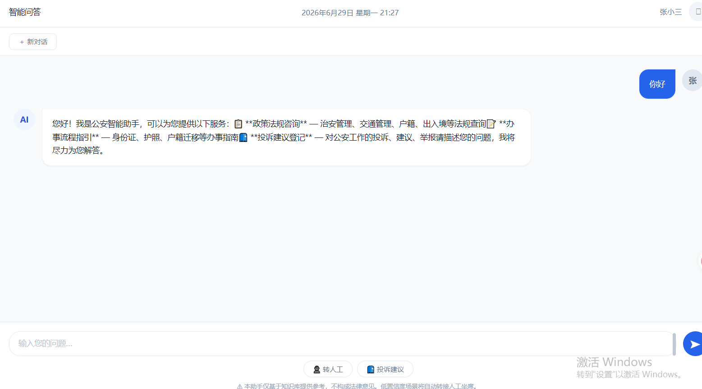
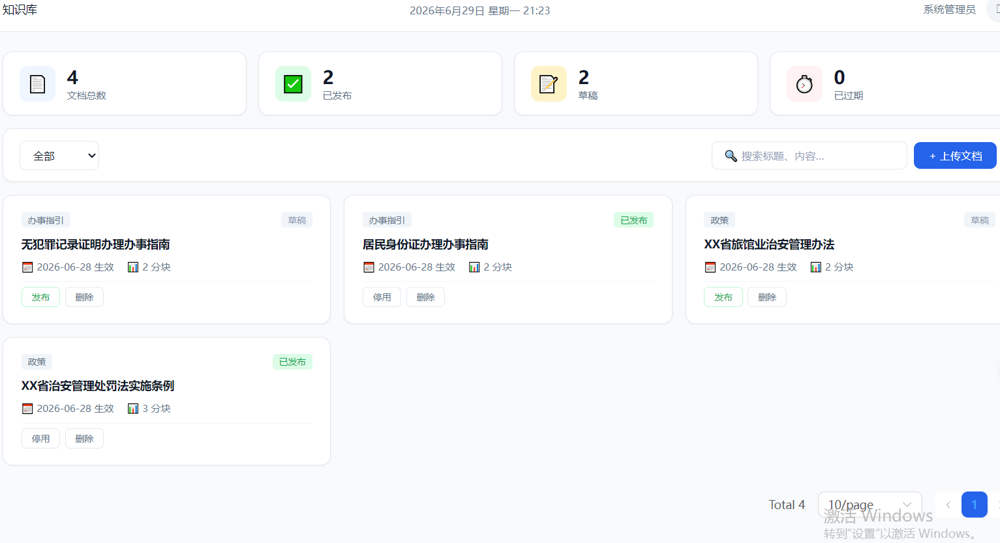
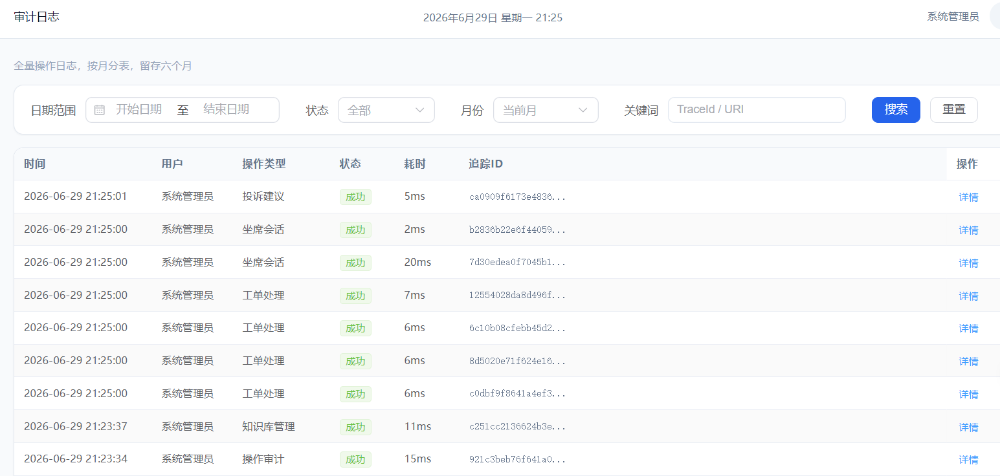
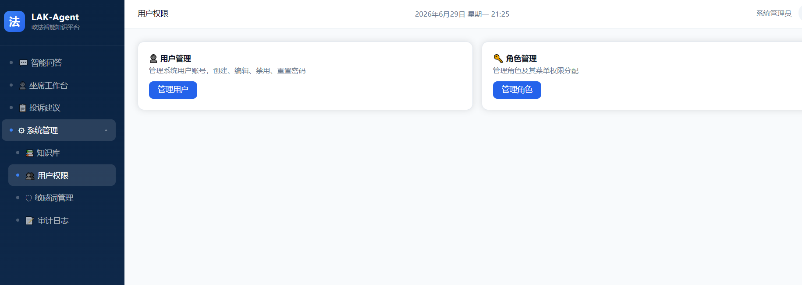

<p align="center">
  <h1 align="center">🏛️ LAK-Agent</h1>
  <p align="center"><strong>Legal Affairs Knowledge Agent Platform</strong><br>政法智能知识Agent平台</p>
</p>

<p align="center">
  
  
  
  
  
  
</p>

---

## 📖 项目简介 | Overview

面向**政法行业私有化部署**的智能问答平台。采用 **主Agent + 多子Agent** 架构，通过大模型驱动的意图识别与路由分发，将用户诉求自动导向政策RAG问答、办事指引RAG问答或投诉工单创建，满足政务等保要求，实现全链路审计、合规答复、低置信度人工兜底。

A privately-deployed intelligent Q&A platform for the legal & public security sector. Uses a **Master Agent + Sub-Agent** architecture to route user requests to specialized RAG-based agents for policy consultation, procedure guidance, and ticket creation — with full-chain audit logging, compliance validation, and human fallback for low-confidence scenarios.

### 核心能力 | Core Capabilities

| 能力 | 说明 |
|------|------|
| 🔍 **意图识别 + 置信度评估** | 3层置信度（LLM结构化输出 → 政法硬规则 → 术语加权），阈值 ≥ 0.7 路由，< 0.5 兜底 |
| 📚 **RAG 知识检索** | 政策法规 + 办事指南双知识库，1024维稠密向量 + 关键词融合，溯源强制校验 |
| 🎫 **投诉工单创建** | 多轮 Slot-Filling 信息采集（最多5轮），自动创建工单 |
| 🛡️ **双向敏感词校验** | 用户输入前置拦截 + AI答复后置校验，词库热加载 |
| 📋 **全链路审计** | 入站请求/RAG检索/大模型调用/合规结果全量落库，按月分表，6个月留存 |
| 🔐 **JWT + RBAC 认证授权** | Access/Refresh Token 双令牌，ADMIN/OPERATOR/USER 三级角色 + 菜单权限 |

---

## 🏗️ 架构概览 | Architecture

```
客户端 (Web Browser)
  │ HTTPS
  ▼
┌──────────────────────────────────────────────┐
│              接入层 (Filter Chain)              │
│  SensitiveWord → TraceId → Audit → Auth → RL  │
└──────────────────┬───────────────────────────┘
                   │
┌──────────────────┴───────────────────────────┐
│           业务编排层 (Orchestration)             │
│  MasterAgent → SubAgentScheduler              │
│   ├─ agent-policy     (政策 RAG + LLM)         │
│   ├─ agent-procedure  (指引 RAG + LLM)         │
│   └─ agent-complaint  (Slot-Filling + 工单)     │
└──────────────────┬───────────────────────────┘
                   │
┌──────────────────┴───────────────────────────┐
│             能力层 (Capabilities)               │
│  RAG Engine │ Dialog Manager │ Ticket Adapter │
└──────────────────┬───────────────────────────┘
                   │
┌──────────────────┴───────────────────────────┐
│              数据层 (Data Layer)                │
│  MySQL 8.0 │ Redis 7 │ Qdrant │ MinIO         │
└──────────────────────────────────────────────┘
```

---

## 📸 页面预览 | Screenshots

<p align="center">
  <strong>智能对话</strong> — AI 流式答复 + 溯源引用卡片<br>
  
</p>

<p align="center">
  <strong>知识库管理</strong> — 文档上传 / 发布 / 检索<br>
  
</p>

<p align="center">
  <strong>操作审计</strong> — 全链路日志查询 + 详情弹窗<br>
  
</p>

<p align="center">
  <strong>系统管理</strong> — 角色权限 / 用户管理 / 敏感词热加载<br>
  
</p>


---

## 🚀 快速开始 | Quick Start

### 环境要求 | Prerequisites

- **JDK 17+** | **Maven 3.8+** | **Node.js 18+** | **Docker + Compose**

### 1. 启动基础设施 | Start Infrastructure

```bash
cd docker
docker compose up -d
```

### 2. 配置环境变量 | Set Environment

```bash
export DASHSCOPE_API_KEY="your-aliyun-dashscope-key"
export JWT_SECRET="your-32-byte-jwt-secret-key-here"
```

### 3. 启动后端 | Start Backend

```bash
cd backend
mvn clean package -DskipTests
java -jar target/lak-ai-platform-0.1.0-SNAPSHOT.jar
```

验证: `curl http://localhost:8080/api/v1/health`

### 4. 启动前端 | Start Frontend

```bash
cd frontend
npm install
npm run dev
```

访问: **http://localhost:5173** | 登录: `admin / admin123`

<details>
<summary>📦 Docker 基础设施服务</summary>

| 服务 | 端口 | 镜像 |
|------|------|------|
| MySQL 8.0 | 3306 | `mysql:8.0` |
| Redis 7 | 6379 | `redis:7-alpine` |
| Qdrant | 6333/6334 | `qdrant/qdrant:latest` |
| MinIO | 9000/9001 | `minio/minio:latest` |

</details>

---

## 📁 项目结构 | Project Structure

```
LAK-Agent/
├── README.md                          # 本文件
├── CLAUDE.md                          # AI 编码协作入口
├── 政法智能知识Agent平台.md              # 项目总纲（中文）
├── docs/
│   ├── design/                        # 设计文档（8份）
│   │   ├── 系统架构设计说明书.md
│   │   ├── 数据库设计说明书.md
│   │   ├── 接口设计说明书.md
│   │   ├── 知识库与RAG详细设计.md
│   │   ├── 多轮对话与Agent调度设计.md
│   │   ├── 安全合规设计说明书.md
│   │   └── 部署运维手册.md
│   └── review/                        # 审查报告
├── backend/                           # Spring Boot 3.4 后端
│   ├── pom.xml
│   └── src/main/java/com/lak/ai/
│       ├── controller/                # REST 控制器
│       ├── service/
│       │   ├── agent/                 # Agent 编排引擎
│       │   │   ├── master/            #   主Agent（意图+置信度）
│       │   │   ├── sub/               #   子Agent（Policy/Procedure/Complaint）
│       │   │   └── scheduler/         #   调度器
│       │   ├── rag/                   # RAG 引擎
│       │   │   ├── embedding/         #   向量化服务
│       │   │   ├── retriever/         #   混合检索器
│       │   │   ├── chunker/           #   文档分块器
│       │   │   └── tracer/            #   溯源追踪器
│       │   ├── chat/                  # 对话管理（会话+上下文+SlotFilling）
│       │   ├── knowledge/             # 知识库全生命周期
│       │   ├── ticket/                # 工单模块
│       │   ├── audit/                 # 审计日志
│       │   └── security/              # 认证授权
│       ├── model/                     # 数据模型
│       │   ├── entity/                #   数据库实体 (DO)
│       │   ├── dto/                   #   数据传输对象 (DTO)
│       │   ├── vo/                    #   视图对象 (VO)
│       │   └── bo/                    #   业务对象 (BO)
│       ├── mapper/                    # Mybatis-Plus Mapper
│       ├── config/                    # 配置类
│       ├── enums/                     # 枚举
│       ├── constant/                  # 常量
│       └── exception/                 # 自定义异常
├── frontend/                          # Vue 3 + Element Plus 前端
│   └── src/
│       ├── views/                     # 页面
│       │   ├── ChatView.vue           #   智能对话
│       │   ├── TicketView.vue         #   工单查询
│       │   ├── knowledge/             #   知识库管理
│       │   └── admin/                 #   系统管理
│       ├── components/                # 通用组件
│       ├── api/                       # API 封装
│       ├── stores/                    # Pinia 状态管理
│       ├── router/                    # 路由配置
│       └── types/                     # TypeScript 类型
└── docker/
    ├── docker-compose.yml             # 基础设施编排
    ├── .env                           # 环境变量
    └── init-scripts/                  # 数据库初始化脚本
```

---

## 🛠️ 技术栈 | Tech Stack

| 层级 | 技术 | 版本 | 说明 |
|------|------|------|------|
| **后端框架** | Spring Boot | 3.4.2 | Java 企业级微服务框架 |
| **AI 编排** | LangChain4j | 1.14.0 | 20+ 大模型集成 + RAG 支持 |
| **大模型** | Qwen3.7-Max (百炼) | — | 中文理解 SOTA |
| **向量模型** | text-embedding-v4 (百炼) | — | 1024维稠密向量 |
| **向量数据库** | Qdrant | latest | Rust 实现，原生混合检索 |
| **关系数据库** | MySQL | 8.0 | 业务数据 + 审计日志（按月分表） |
| **缓存** | Redis | 7 | 会话记忆 + 限流 + 分布式锁 |
| **对象存储** | MinIO / 本地磁盘 | — | 文档文件存储 |
| **ORM** | Mybatis-Plus | 3.5.6 | 增强 Mybatis |
| **韧性** | Resilience4j | 2.2.0 | 熔断 + 重试 + 降级 |
| **文档** | SpringDoc | 2.8.0 | OpenAPI 3.0 接口文档 |
| **前端框架** | Vue 3 | 3.5 | Composition API + TypeScript |
| **UI 库** | Element Plus | 2.9 | 企业级 Vue 3 组件库 |
| **构建** | Vite | 6.x | 极速开发体验 |
| **HTTP** | Axios | 1.x | 拦截器 + Token 注入 |
| **SSE** | @microsoft/fetch-event-source | 2.x | 流式对话 |

---

## 📡 API 端点 | API Endpoints

> 完整接口文档见 [接口设计说明书](docs/design/接口设计说明书.md)

| 方法 | 路径 | 认证 | 说明 |
|------|------|------|------|
| `GET` | `/api/v1/health` | 无 | 健康检查 |
| `POST` | `/api/v1/auth/login` | 无 | 用户登录 |
| `GET` | `/api/v1/auth/captcha` | 无 | 获取验证码 |
| `POST` | `/api/v1/auth/refresh` | 无 | 刷新 Token |
| `POST` | `/api/v1/chat/message` | JWT | 发送消息（支持 SSE 流式） |
| `GET` | `/api/v1/chat/sessions` | JWT | 会话列表 |
| `GET` | `/api/v1/chat/sessions/{id}` | JWT | 会话历史 |
| `DELETE` | `/api/v1/chat/sessions/{id}` | JWT | 删除会话 |
| `POST` | `/api/v1/tickets` | JWT | 创建工单 |
| `GET` | `/api/v1/tickets/{no}` | JWT | 查询工单 |
| `POST` | `/api/v1/knowledge/documents` | JWT | 上传文档 |
| `GET` | `/api/v1/knowledge/documents` | JWT | 文档列表 |
| `PATCH` | `/api/v1/knowledge/documents/{id}/status` | JWT | 发布/下架 |
| `GET` | `/api/v1/admin/audit-logs` | JWT+ADMIN | 审计日志 |
| `POST` | `/api/v1/admin/sensitive-words/reload` | JWT+ADMIN | 敏感词热加载 |

统一响应格式: `{ "code": 200, "message": "success", "data": {...}, "traceId": "..." }`

---

## 📚 文档索引 | Documentation

| 文档 | 说明 |
|------|------|
| [政法智能知识Agent平台.md](政法智能知识Agent平台.md) | 项目总纲 — 定位、技术栈、业务流、编码规范 |
| [系统架构设计说明书](docs/design/系统架构设计说明书.md) | 四层架构、Filter Chain、会话状态机、部署拓扑 |
| [数据库设计说明书](docs/design/数据库设计说明书.md) | ER 图、9 张表 DDL、索引策略、分表归档方案 |
| [接口设计说明书](docs/design/接口设计说明书.md) | 15 个 API 端点、统一响应、25 个错误码 |
| [知识库与RAG详细设计](docs/design/知识库与RAG详细设计.md) | 文档解析/分块/向量化、混合检索、溯源机制 |
| [多轮对话与Agent调度设计](docs/design/多轮对话与Agent调度设计.md) | 主Agent路由、3子Agent、会话状态机、SSE流式 |
| [安全合规设计说明书](docs/design/安全合规设计说明书.md) | Filter Chain、JWT+RBAC、敏感词双向校验、审计防篡改 |
| [部署运维手册](docs/design/部署运维手册.md) | Docker Compose、构建部署、备份恢复、故障排查 |
| [CLAUDE.md](CLAUDE.md) | AI 编码协作入口 — 快速参考 |

---

## 🔧 开发指南 | Development Guide

### 后端

```bash
cd backend
mvn spring-boot:run -Dspring-boot.run.profiles=dev
```

- 业务端口: `8080` | 管理端口: `8081`
- Swagger UI: http://localhost:8080/swagger-ui.html (dev only)
- Flyway 在启动时自动执行数据库迁移
- 测试数据自动加载（首次启动时，可通过 `lak.test-data.load-on-startup=false` 关闭）

### 前端

```bash
cd frontend
npm run dev       # 开发服务器 :5173
npm run build     # 生产构建 → dist/
```

- Vite 代理: `/api` → `http://localhost:8080`
- 开发环境 CORS 已配置 `localhost:5173`

---

## 📊 项目状态 | Project Status

| 模块 | 状态 |
|------|------|
| 认证登录 (JWT + Captcha) | ✅ 完成 |
| 智能对话 (Chat + SSE 流式) | ✅ 完成 |
| 工单系统 (创建 + 查询) | ✅ 完成 |
| 知识库管理 (上传/发布/下架/检索) | ✅ 完成 |
| 用户管理 (CRUD + 角色分配) | ✅ 完成 |
| 角色管理 (CRUD + 权限分配) | ✅ 完成 |
| 操作审计 (分页查询 + 按月分表 + 详情) | ✅ 完成 |
| 敏感词管理 (热加载) | ✅ 完成 |
| RAG 引擎 (检索 + 分块 + 溯源) | ✅ 完成 |
| Agent 编排 (主Agent + 3子Agent) | ✅ 完成 |
| Dashboard 统计仪表盘 | ⬜ 待实现 |
| 审计分表自动创建/归档 | ⬜ 待实现 |

---

## ⚠️ 安全提示 | Security Notice

- 部署后**立即修改**默认管理员密码 (`admin / admin123`)
- 生产环境**必须**通过环境变量注入 `JWT_SECRET` 和 `DASHSCOPE_API_KEY`
- 生产环境**必须**将验证码从明文改为 base64 图片
- 审计日志表**仅允许** `INSERT + SELECT`，禁止 `UPDATE/DELETE`
- 敏感词库文件**不得**提交到版本控制（当前 `config/sensitive-words.txt` 为模板）

---

<p align="center">
  <sub>Built with ❤️ for the public security sector | 为政法行业量身打造</sub>
</p>
