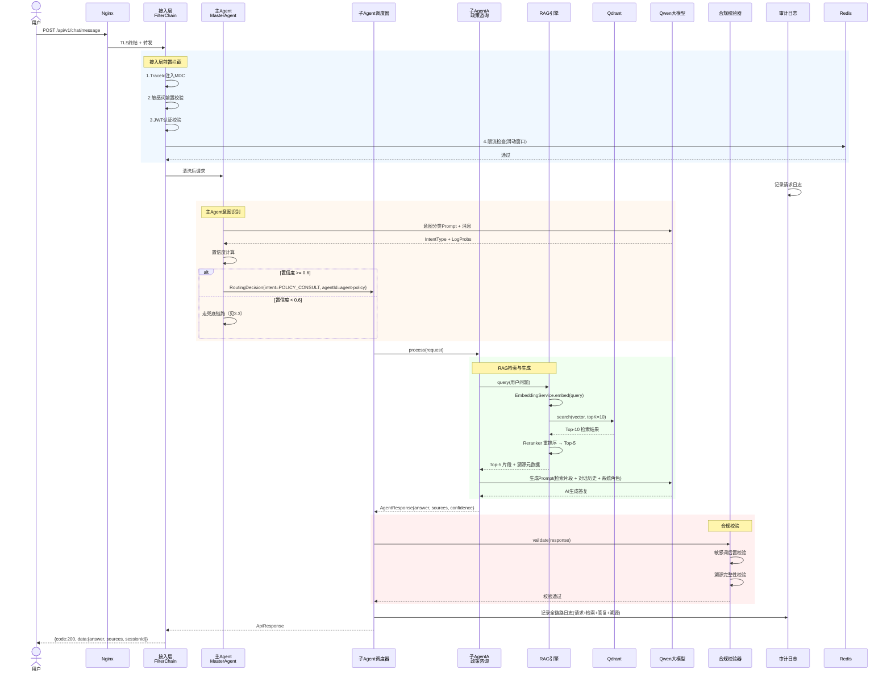
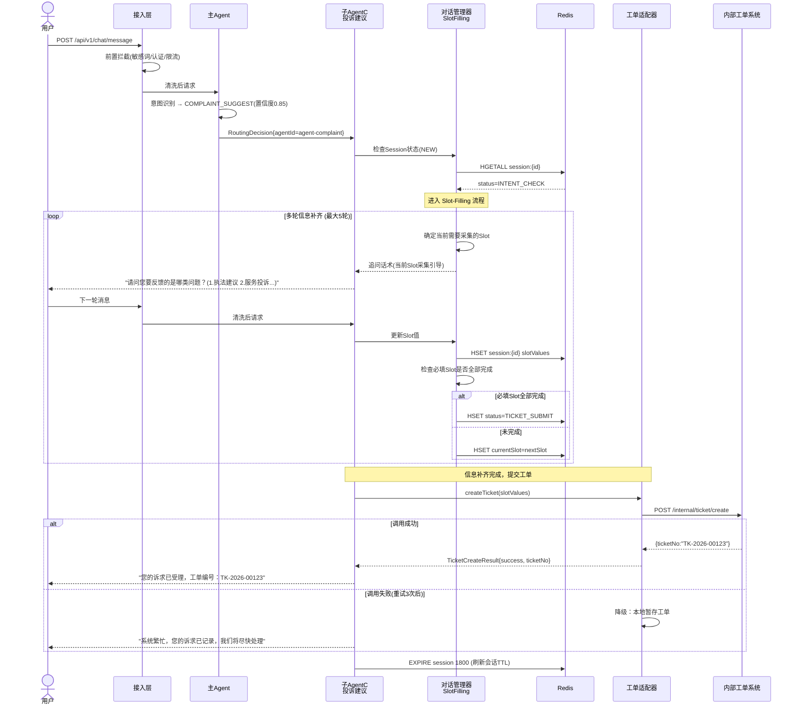
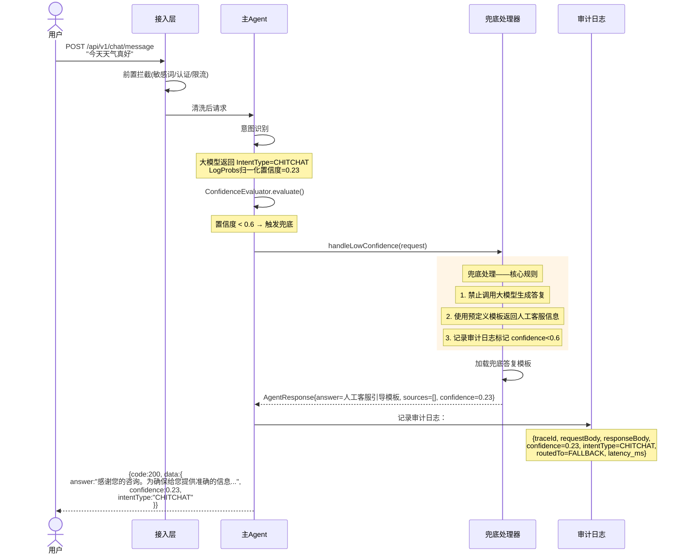

# 系统架构设计说明书

> **项目名称**：LAK-Agent（Legal Affairs Knowledge Agent Platform / 政法智能知识Agent平台）
> **文档版本**：v1.0
> **编制日期**：2026-06-17
> **文档状态**：评审中
> **密级**：内部

---

## 1. 系统概述

### 1.1 项目背景与定位

LAK-Agent 是面向政法行业私有化部署的智能问答平台。政法领域日常工作中存在大量政策咨询、办事流程指引、投诉建议受理等重复性问答场景，传统人工坐席模式响应慢、口径不一、审计追溯困难。本平台采用主Agent+多子Agent架构，通过大模型驱动的意图识别与路由分发，将用户诉求自动导向对应的政策RAG问答、办事指引RAG问答或投诉工单创建子Agent，实现智能、合规、可审计的自动化政务问答服务。

平台定位为**政法单位内部辅助工具**，不替代人工决策，所有AI答复必须携带溯源依据，低置信度场景自动兜底至人工客服，确保在提升效率的同时不降低合规底线。

### 1.2 系统目标

| 目标维度 | 具体指标 | 实现手段 |
|---------|---------|---------|
| **可用性** | 核心问答链路可用性 ≥ 99.5% | 无状态服务节点 + 中间件集群 + 熔断降级 |
| **安全合规** | 等保2.0三级预置扩展点，全链路审计日志6个月留存 | 敏感词双向校验 + TLS通信加密 + 审计日志防篡改 |
| **可扩展** | 新增子Agent ≤ 3个步骤，切换大模型 ≤ 1个配置文件 | Agent注册机制 + 大模型适配层抽象 |
| **可追溯** | 所有AI答复100%携带溯源文档引用 | RAG溯源链强制校验 + 审计日志模型入参出参全记录 |
| **响应性能** | P95 延迟 ≤ 5s（含大模型生成） | Redis缓存热数据 + 向量检索索引优化 + 大模型超时熔断 |

### 1.3 全局约束

| 约束项 | 取值 | 备注 |
|-------|------|------|
| 包名 | `com.lak.ai` | 全局 Java 包基础路径 |
| 服务名 | `lak-ai-platform` | Spring Boot application name |
| 数据库名 | `lak_ai_platform` | MySQL schema 名称 |
| 业务端口 | `8080` | REST API 对外服务端口 |
| 管理端口 | `8081` | Actuator 健康检查与监控端口 |
| JDK 版本 | JDK 17 | LTS 版本 |
| 核心框架 | Spring Boot 3.4.2 | — |
| AI 框架 | LangChain4j 1.14.0 | — |
| 大模型 | Qwen3.7-Max（百炼） | 对话生成 |
| 向量模型 | text-embedding-v4（百炼） | 文本向量化 |
| 向量数据库 | Qdrant | 私有化部署 |
| 缓存 | Redis 7 | 会话 + 限流 |
| 关系数据库 | MySQL 8.0 | 业务数据 + 审计日志 |
| 文件存储 | MinIO（生产）/ 本地磁盘（开发） | 文档原始文件 |
| 日志留存 | 6 个月（政务要求） | 按月分表 + 定期归档 |

---

## 2. 架构分层设计

### 2.1 架构分层总览

```
┌─────────────────────────────────────────────────────────────────┐
│                        客 户 端                                   │
│                (Web 浏览器 / 移动端 / 第三方系统)                    │
└──────────────────────────────┬──────────────────────────────────┘
                               │ HTTPS (TLS 1.2+)
                               ▼
┌─────────────────────────────────────────────────────────────────┐
│  2.1 接入层 (Access Layer)                                        │
│  ┌──────────┐ ┌──────────┐ ┌──────────┐ ┌───────────────────┐  │
│  │ Nginx    │ │ Auth     │ │ Rate     │ │ SensitiveWord     │  │
│  │ Reverse  │─▶│ Filter   │─▶│ Limiter  │─▶│ PreCheck          │  │
│  │ Proxy    │ │          │ │          │ │                   │  │
│  └──────────┘ └──────────┘ └──────────┘ └───────────────────┘  │
│  职责: HTTPS终结、认证鉴权、限流、日志拦截、敏感词前置校验            │
└──────────────────────────────┬──────────────────────────────────┘
                               │
                               ▼
┌─────────────────────────────────────────────────────────────────┐
│  2.2 业务编排层 (Orchestration Layer)                              │
│  ┌──────────────────────────────────────────────────────────────┐│
│  │                    主Agent (MasterAgent)                     ││
│  │  ┌─────────────┐  ┌──────────────┐  ┌─────────────────┐    ││
│  │  │ Intent      │  │ Confidence   │  │ Route           │    ││
│  │  │ Classifier  │─▶│ Evaluator    │─▶│ Dispatcher      │    ││
│  │  └─────────────┘  └──────────────┘  └────────┬────────┘    ││
│  └───────────────────────────────────────────────┼─────────────┘│
│                                                   │              │
│  ┌────────────────────────────────────────────────┼─────────────┐│
│  │              子Agent调度器 (SubAgentScheduler)  │              ││
│  │                                                ▼              ││
│  │   ┌──────────┐  ┌──────────┐  ┌──────────┐                  ││
│  │   │ AgentA   │  │ AgentB   │  │ AgentC   │  (可扩展...)     ││
│  │   │ 政策咨询  │  │ 办事指引  │  │ 投诉建议  │                  ││
│  │   └────┬─────┘  └────┬─────┘  └────┬─────┘                  ││
│  └────────┼──────────────┼──────────────┼────────────────────────┘│
│  职责: 意图识别与置信度判断、路由分发、Agent生命周期管理               │
└───────────┼──────────────┼──────────────┼────────────────────────┘
            │              │              │
            ▼              ▼              ▼
┌─────────────────────────────────────────────────────────────────┐
│  2.3 能力层 (Capability Layer)                                    │
│  ┌──────────────┐ ┌──────────────┐ ┌──────────────┐             │
│  │ RAG Engine   │ │ Dialog Mgr   │ │ Ticket       │             │
│  │ ──────────── │ │ ──────────── │ │ Adapter      │             │
│  │ ·向量检索    │ │ ·会话状态机  │ │ ──────────── │             │
│  │ ·知识库查询  │ │ ·上下文窗口  │ │ ·工单接口封装│             │
│  │ ·重排序      │ │ ·Slot-Filling│ │ ·字段映射    │             │
│  └──────┬───────┘ └──────┬───────┘ └──────┬───────┘             │
│         │                │                │                      │
│  ┌──────┴────────────────┴────────────────┴───────┐             │
│  │           合规校验器 (ComplianceValidator)       │             │
│  │  · 敏感词后置校验  · 溯源完整性校验              │             │
│  │  · 答复格式校验    · 安全合规审查                │             │
│  └────────────────────────────────────────────────┘             │
│  职责: RAG检索与生成、对话会话管理、工单接口适配、结果合规校验       │
└──────────────────────────────┬──────────────────────────────────┘
                               │
                               ▼
┌─────────────────────────────────────────────────────────────────┐
│  2.4 数据层 (Data Layer)                                          │
│  ┌──────────┐ ┌──────────┐ ┌──────────┐ ┌──────────┐           │
│  │ Qdrant   │ │ MySQL    │ │ Redis 7  │ │ MinIO    │           │
│  │ 向量存储  │ │ 业务+审计 │ │ 会话+限流 │ │ 文件存储  │           │
│  └──────────┘ └──────────┘ └──────────┘ └──────────┘           │
│  职责: 数据持久化、缓存、向量检索、文件存取                          │
└─────────────────────────────────────────────────────────────────┘
```

### 2.2 接入层详细设计

**职责**：作为系统的安全边界，对所有入站请求执行统一的前置处理。本层不包含业务逻辑，只做拦截与校验。

**核心组件**：

| 组件 | 类型 | 职责 | 技术实现 |
|------|------|------|---------|
| Nginx 反向代理 | 基础设施 | HTTPS 终结、静态资源、请求转发、连接数限制 | Nginx 1.24+ |
| AuthFilter | Spring Interceptor | JWT Token 校验、用户身份注入 | OncePerRequestFilter |
| RateLimiter | Spring Interceptor + Redis | 基于用户的请求频率限制 | Redis Lua 脚本滑动窗口 |
| AuditLogInterceptor | Spring Interceptor | 请求体/响应体捕获 + TraceId 注入 | SLF4J MDC + ContentCachingRequestWrapper |
| SensitiveWordPreCheck | Spring Filter | 用户输入敏感词前置拦截 | 双数组Trie / Aho-Corasick |

**Filter Chain 注册顺序**（order 值越小越先执行）：

```
order=1  SensitiveWordPreCheck    (敏感词前置校验 → 命中则直接拒绝)
order=2  TraceIdFilter            (生成/提取 TraceId 注入 MDC)
order=3  AuditLogInterceptor      (捕获请求体，记录入站日志)
order=4  AuthFilter               (JWT 校验 → 未认证返回 401)
order=5  RateLimiter              (限流检查 → 超限返回 429)
order=6  RequestMapping           (Spring MVC 路由分发)
```

**对外接口**：本层不直接暴露业务 API，所有配置通过 `application.yml` 管理。

**拦截器白名单**（不经过 AuthFilter）：

| 路径 | 说明 |
|------|------|
| `GET /api/v1/health` | 健康检查 |
| `POST /api/v1/auth/login` | 登录接口 |
| `GET /api/v1/auth/captcha` | 验证码接口 |

**技术选型理由**：
- 采用 Spring Interceptor 而非 Servlet Filter 作为主要拦截机制，理由是 Interceptor 可以直接访问 Spring 容器中的 Bean（如 RedisTemplate、配置服务），便于限流和日志组件注入依赖。
- 敏感词前置校验使用 Filter（order 最低）确保在请求体被读取之前就执行关键校验，Security 优先于所有业务逻辑。

### 2.3 业务编排层详细设计

**职责**：接收接入层清洗后的请求，执行意图识别、置信度判断、路由分发，调度子Agent完成业务处理，并对返回结果进行合规校验后统一封装返回。

#### 2.3.1 主Agent（MasterAgent）

**核心组件**：

| 组件 | 职责 | 输入 | 输出 |
|------|------|------|------|
| IntentClassifier | 调用大模型进行意图分类 | 用户消息 + 对话上下文（最近3轮） | 意图类别 + 分类依据 |
| ConfidenceEvaluator | 评估意图分类的置信度 | 分类结果 + 模型 LogProbs | 置信度分值 (0.0-1.0) |
| RouteDispatcher | 根据意图+置信度决策路由目标 | 意图类别 + 置信度 | 路由目标 (AgentA/B/C 或 兜底处理器) |
| FallbackHandler | 低置信度/无法识别时的兜底处理 | 用户消息 | 人工客服引导答复 |

**意图类别枚举**：

| 意图编码 | 意图名称 | 路由目标 | 置信度阈值 |
|---------|---------|---------|-----------|
| POLICY_CONSULT | 政策咨询 | 子AgentA | ≥ 0.6 |
| PROCEDURE_GUIDE | 办事指引 | 子AgentB | ≥ 0.6 |
| COMPLAINT_SUGGEST | 投诉建议 | 子AgentC | ≥ 0.6 |
| CHITCHAT | 闲聊/无关 | 兜底 | < 0.6 或直接拒绝 |
| UNKNOWN | 无法识别 | 兜底 | < 0.6 |

**置信度策略**：

- 置信度 ≥ 0.6：路由至对应子Agent，正常业务处理
- 置信度 < 0.6：触发兜底，返回人工客服引导，**禁止调用大模型生成答复**
- 置信度来源：大模型 LogProbs 归一化值 + 关键词规则匹配加分（政法领域高频术语加权）

**兜底处理规范**（FallbackHandler 输出模板）：

```
感谢您的咨询。为确保给您提供准确的信息，建议您通过以下方式联系我们的人工客服：
- 服务热线：XXX-XXXXXXXX
- 工作时间：工作日 9:00-17:00
- 在线留言：XXX
```

**决策理由**：对低置信度场景采用保守策略——宁可拒答引导人工，也不可给出可能错误的AI答复。这是政法场景的合规底线。

#### 2.3.2 子Agent调度器（SubAgentScheduler）

**职责**：管理子Agent的注册、生命周期、路由调度。采用**策略模式**实现，新增子Agent只需实现统一接口并注册。

**子Agent统一接口**：

```java
public interface SubAgent {
    /** Agent 唯一标识 */
    String getAgentId();
    /** Agent 名称 */
    String getAgentName();
    /** 支持的意图类别 */
    IntentType[] getSupportedIntents();
    /** 执行业务处理 */
    AgentResponse process(AgentRequest request);
}
```

**子Agent注册表**：

| Agent ID | Agent 名称 | 支持意图 | 核心能力 |
|----------|-----------|---------|---------|
| agent-policy | 政策咨询Agent | POLICY_CONSULT | 政法政策库RAG检索 + 大模型生成 |
| agent-procedure | 办事指引Agent | PROCEDURE_GUIDE | 办事指南库RAG检索 + 大模型生成 |
| agent-complaint | 投诉建议Agent | COMPLAINT_SUGGEST | 多轮Slot-Filling + 工单创建 |

**调度流程**：

1. 主Agent 完成意图识别与置信度判断，产出 `RoutingDecision { intentType, confidence, targetAgentId }`
2. Scheduler 根据 `targetAgentId` 查找对应的 SubAgent 实例
3. 调用 `subAgent.process(request)` 执行业务处理
4. 接收 `AgentResponse`，传递给合规校验器
5. 合规校验通过后，统一封装为 `ApiResponse` 返回

**串行调度策略**：当前阶段所有请求均为单一意图，不涉及多Agent协作。架构预留了并行调度扩展点——RouteDispatcher 的 `RoutingDecision` 设计为可包含多个 `targetAgentId`，Scheduler 可通过 `CompletableFuture.allOf()` 实现并行调度。

**对外接口**：本层不直接暴露 HTTP 端点，通过接入层的 `ChatController` 接收请求后调用。

### 2.4 能力层详细设计

**职责**：提供可复用的原子能力组件，供子Agent在业务处理流程中调用。每个能力组件职责单一、接口明确、无状态（或状态通过Redis共享）。

#### 2.4.1 RAG引擎（RagEngine）

**核心组件**：

| 组件 | 职责 | 技术实现 |
|------|------|---------|
| EmbeddingService | 将文本转换为稠密向量 (Dense Vector) | 调用百炼 text-embedding-v4 API |
| SparseEmbeddingService | 将文本转换为稀疏向量 (Sparse Vector) | BM25/BM42 算法，Qdrant 原生计算 IDF |
| HybridRetriever | 稠密+稀疏混合检索 + RRF 融合排序 | Qdrant Named Vectors + FusionQuery |
| KnowledgeRepo | 知识库元数据与内容查询 | MySQL（元数据）+ Qdrant（双向量） |
| Reranker | 混合检索结果精排 | 可选，混合检索的 RRF 融合已替代大部分重排序工作 |
| SourceTracer | 溯源信息组装 | 从检索结果提取来源文档编号、名称、生效日期、原文片段 |

**检索流程（混合检索三阶段）**：

```
用户问题
  │
  ├─→ EmbeddingService.embed(query)           // 阶段1a: 生成 Dense Vector (语义理解)
  └─→ SparseEmbeddingService.encode(query)    // 阶段1b: 生成 Sparse Vector (关键词匹配)
        │
        ▼
  HybridRetriever.search(                      // 阶段2: Qdrant 原生混合检索
      dense=vector,          using="dense",  limit=10,
      sparse=sparseVector,   using="sparse", limit=10,
      fusion=RRF                             // Reciprocal Rank Fusion
  )
        │
        ▼
  Reranker.rerank(query, hybridResults)       // 阶段3: 精排 → Top-5（可选）
        │
        ▼
  SourceTracer.buildSources(top5Results)      // 提取溯源信息
        │
        ▼
  返回 Top-5 检索片段 + 溯源元数据
```

**为什么混合检索对政法场景至关重要**：

| 查询类型 | 纯向量检索 | 混合检索 |
|---------|-----------|---------|
| "《政法工作条例》第15条"（精确引用） | ❌ 可能召回不相关内容 | ✅ 关键词精确定位 |
| "执法过程中如何保障当事人权益"（语义理解） | ✅ 语义匹配 | ✅ 语义+关键词叠加 |
| "行政复议 时效"（专业术语+关键词） | ⚠️ 偏语义可能遗漏 | ✅ Sparse 命中术语，Dense 补充语义 |
| 文件编号 "X政发〔2024〕12号" | ❌ 纯向量无法精确匹配 | ✅ Sparse 向量精确命中 |

**检索参数建议值**：

| 参数 | 建议值 | 说明 |
|------|--------|------|
| Dense 向量维度 | 1536 | text-embedding-v4 输出维度 |
| Sparse 向量稀疏度 | 自动 | BM25/BM42 算法自动生成 |
| Dense 检索 Top-K | 10 | 语义相似度分支召回量 |
| Sparse 检索 Top-K | 10 | 关键词分支召回量 |
| RRF 融合后 Top-K | 5 | 送入大模型上下文的最终片段数 |
| RRF 常数 k | 60 | Reciprocal Rank Fusion 标准参数 |
| 相似度阈值 | ≥ 0.75 | 低于此分数的片段不送入大模型 |
| 最大检索超时 | 3s | 超过此时间触发降级 |

**知识库逻辑隔离**：不同子Agent使用不同的 Qdrant Collection：
- `lak_policy_docs` → 政法政策库（AgentA 使用）
- `lak_procedure_docs` → 办事指南库（AgentB 使用）

#### 2.4.2 对话管理器（DialogManager）

**核心组件**：

| 组件 | 职责 | 实现要点 |
|------|------|---------|
| SessionManager | 会话生命周期管理 | Redis 存储，TTL 30 分钟自动过期 |
| ContextWindow | 上下文窗口裁剪 | 滑动窗口（保留最近 N 轮）+ 摘要压缩 |
| SlotFillingEngine | 多轮信息补齐（投诉场景） | 状态机驱动，逐个收集必填字段 |

**会话状态机**：

```
                  ┌─────────┐
       用户发起对话 │  NEW    │
                  └────┬────┘
                       │ 接入层前置拦截通过
                       ▼
                  ┌─────────┐
                  │ INTENT  │ 主Agent意图识别
                  │ _CHECK  │
                  └────┬────┘
                       │
            ┌──────────┼──────────┐
            ▼          ▼          ▼
       ┌─────────┐ ┌────────┐ ┌─────────┐
       │ ANSWERING│ │COLLECT │ │ FALLBACK│
       │ (政策/指引)│ │_INFO  │ │ (兜底)   │
       └────┬────┘ │(投诉补齐)│ └────┬────┘
            │      └───┬────┘      │
            │          │ 补齐完成   │
            ▼          ▼           │
       ┌─────────┐ ┌────────┐     │
       │ COMPLIANCE│ │TICKET │     │
       │ _CHECK  │ │_SUBMIT│     │
       └────┬────┘ └───┬────┘     │
            │          │          │
            ▼          ▼          ▼
       ┌─────────────────────────────┐
       │          CLOSED             │
       └─────────────────────────────┘
```

**状态说明**：

| 状态 | 触发条件 | 行为 |
|------|---------|------|
| NEW | 会话创建 | 分配 sessionId，写入 Redis Hash |
| INTENT_CHECK | 首条消息到达 | 调用主Agent意图识别 |
| ANSWERING | 意图置信度 ≥ 0.6（政策/指引） | 调用 RAG + 大模型生成答复 |
| COLLECT_INFO | 意图 = COMPLAINT_SUGGEST | 进入多轮 Slot-Filling 流程 |
| FALLBACK | 置信度 < 0.6 | 兜底答复，引导人工客服 |
| COMPLIANCE_CHECK | 答复生成完成 | 合规校验器审查 |
| TICKET_SUBMIT | 投诉信息补齐完成 | 调用工单接口创建工单 |
| CLOSED | 用户主动关闭 / 会话超时 | Redis 会话 TTL 过期(30min) |

**上下文窗口策略**：

- 保留最近 **10 轮**对话（20条消息：10 user + 10 assistant）
- 超出窗口的消息：按策略执行
  - **策略A（默认）**：滑动窗口，直接丢弃最早的消息
  - **策略B（摘要压缩）**：对早期消息调用大模型摘要后保留摘要文本
- Token 上限：送入大模型的上下文总 Token ≤ 6000（为 Qwen3.7-Max 32K 上下文预留充足余量）

**Slot-Filling 流程（投诉子AgentC专用）**：

| 槽位字段 | 字段类型 | 必填 | 采集方式 | 追问话术模板 |
|---------|---------|------|---------|------------|
| complaint_type | 枚举 | 是 | 多选引导 | "请问您要反馈的是哪类问题？（1.执法建议 2.服务投诉 3.违纪举报 4.其他）" |
| contact_name | 文本 | 是 | 自由输入 | "请留下您的称呼：" |
| contact_phone | 文本(正则校验) | 是 | 自由输入 | "请留下您的联系电话：" |
| description | 长文本 | 是 | 自由输入 | "请详细描述您的问题：" |
| attachment | 文件(可选) | 否 | 上传引导 | "如有相关材料可上传（可选）：" |

- 最大追问轮数：**5 轮**
- 超限处理：提示用户"信息采集超时，您可以通过以下方式直接联系我们的人工客服..."

**Redis 会话存储结构**：

```
Key:   session:{sessionId}
Type:  Hash
Fields:
  - userId
  - status          (当前状态机状态)
  - intentType      (识别出的意图)
  - confidence      (置信度)
  - contextWindow   (JSON: 最近N轮消息)
  - slotValues      (JSON: Slot-Filling 当前值)
  - currentSlot     (当前正在采集的槽位名)
  - fillRound       (当前补齐轮数)
  - createTime
  - lastActiveTime
TTL: 1800 秒 (30 分钟)
```

#### 2.4.3 工单适配器（TicketAdapter）

**职责**：封装与内部工单系统的接口调用，将AgentC补齐的结构化信息映射为工单创建请求，处理接口异常与重试。

**对外接口封装**：

```java
public interface TicketAdapter {
    /**
     * 创建工单
     * @param request 工单创建请求（从 Slot-Filling 结果构建）
     * @return 工单创建结果（含工单编号）
     */
    TicketCreateResult createTicket(TicketCreateRequest request);

    /**
     * 查询工单状态
     * @param ticketNo 工单编号
     * @return 工单当前状态
     */
    TicketStatus queryStatus(String ticketNo);
}
```

**重试与容错策略**：

| 参数 | 建议值 | 说明 |
|------|--------|------|
| 最大重试次数 | 3 | 含首次调用 |
| 重试间隔 | 1s / 3s / 5s | 指数退避 |
| 连接超时 | 5s | — |
| 读取超时 | 10s | — |
| 熔断阈值 | 5次失败 / 30s窗口 | Resilience4j CircuitBreaker |
| 降级策略 | 本地暂存工单数据 + 异步补发 | 保证投诉不丢失 |

#### 2.4.4 合规校验器（ComplianceValidator）

**职责**：在所有AI生成答复返回用户之前，执行安全与合规校验。这是政法场景的强制性安全屏障。

**校验项链条**（全部通过才可返回）：

```
AI答复 → 1.敏感词后置校验 → 2.溯源完整性校验 → 3.答复格式校验 → 放行
              │                    │                    │
              ▼                    ▼                    ▼
         含敏感词：拒绝          缺少溯源：拒绝        格式异常：拒绝
         记录告警日志            补充溯源或拒绝        记录异常日志
```

| 校验项 | 规则 | 不通过处理 |
|--------|------|-----------|
| 敏感词后置校验 | 答复内容不得包含预定义敏感词列表中的任何词汇 | 答复不返回，记录告警日志，返回"系统繁忙"通用答复 |
| 溯源完整性校验 | 每条AI答复必须包含至少1条溯源引用（来源文档编号 + 原文片段） | 拦截，触发补充检索或返回兜底答复 |
| 答复长度校验 | 空答复或长度 < 10 字符视为异常 | 拦截，记录异常日志 |
| 模型调用异常标记 | 检查 AgentResponse 是否携带大模型调用异常标记 | 如异常，走降级流程 |

**敏感词双向校验拦截点**：
- **前置拦截点**：接入层 `SensitiveWordPreCheck` Filter — 检测用户输入
- **后置拦截点**：能力层 `ComplianceValidator` — 检测AI生成内容
- **敏感词库来源**：可配置词库文件 `/config/sensitive-words.txt`，支持动态加载

### 2.5 数据层详细设计

**职责**：为上层提供数据持久化、缓存、向量检索和文件存储能力。所有存储组件的访问通过 Repository/Dao 层封装，上层不得直接操作数据库连接。

#### 2.5.1 MySQL 8.0（关系数据库）

**职责**：存储业务数据（会话摘要、工单数据）和审计日志。

**数据库连接配置建议**：

| 参数 | 建议值 | 说明 |
|------|--------|------|
| 连接池 | HikariCP (Spring Boot 默认) | — |
| maximumPoolSize | 20 | 最大连接数 |
| minimumIdle | 5 | 最小空闲连接 |
| connectionTimeout | 30000ms | 获取连接超时 |
| idleTimeout | 600000ms | 空闲连接超时 |
| maxLifetime | 1800000ms | 连接最大存活时间 |

**核心表**（详细 DDL 见 `数据库设计说明书.md`）：

| 表名 | 职责 | 预估数据量 |
|------|------|-----------|
| `chat_session` | 对话会话摘要 | 万级/月 |
| `chat_message` | 消息记录（含溯源） | 十万级/月 |
| `ticket` | 工单数据 | 千级/月 |
| `audit_log` | 审计日志 | 百万级/月 → 按月分表 |
| `knowledge_document` | 知识文档元数据（P1） | 万级 |

#### 2.5.2 Qdrant（向量数据库 — 混合检索）

**职责**：存储知识文档的稠密向量（Dense Vector，语义理解）和稀疏向量（Sparse Vector，关键词匹配），通过 Qdrant 原生 Named Vectors + FusionQuery 实现混合检索。

**Collection 双向量设计**（Qdrant v1.7+ Named Vectors）：

```
Collection: lak_policy_docs
├── Dense Vector: 1536维, Cosine（text-embedding-v4 生成）
├── Sparse Vector: BM25/BM42（Qdrant 原生计算 IDF）
└── Payload: {doc_id, title, source_no, effective_date, fragment_text, ...}

Collection: lak_procedure_docs
├── Dense Vector: 1536维, Cosine（text-embedding-v4 生成）
├── Sparse Vector: BM25/BM42（Qdrant 原生计算 IDF）
└── Payload: {doc_id, title, source_no, effective_date, fragment_text, ...}
```

| Collection 名称 | 使用方 | Dense 维度 | Sparse 模式 | 距离度量 | 融合方式 |
|----------------|--------|-----------|------------|---------|---------|
| `lak_policy_docs` | 子AgentA（政策咨询） | 1536 | BM25 + 原生 IDF | Cosine | RRF |
| `lak_procedure_docs` | 子AgentB（办事指引） | 1536 | BM25 + 原生 IDF | Cosine | RRF |

**Qdrant 连接配置建议**：

| 参数 | 建议值 |
|------|--------|
| Host | `localhost`（开发）/ `qdrant.internal`（生产） |
| gRPC Port | 6334 |
| REST Port | 6333 |
| 连接超时 | 10s |
| Dense 索引类型 | HNSW |
| HNSW M 值 | 16 |
| HNSW ef_construct | 100 |
| Sparse 索引类型 | 倒排索引（Qdrant 默认） |
| Sparse IDF 模式 | 实时计算（Modifier.IDF） |

#### 2.5.3 Redis 7（缓存与限流）

**职责**：
1. 会话状态缓存（DialogManager 状态机数据）
2. 限流计数器（RateLimiter 滑动窗口计数）
3. 分布式锁（知识库更新等并发场景）

**Redis 配置建议**：

| 参数 | 建议值 |
|------|--------|
| 连接模式 | Jedis / Lettuce（推荐 Lettuce） |
| connectionPoolSize | 16 |
| 持久化 | AOF everysec |
| 键过期策略 | volatile-lru |
| 业务 DB | db0（会话）/ db1（限流） |

**Key 命名规范**：

| Key Pattern | 用途 | TTL |
|-------------|------|-----|
| `session:{sessionId}` | 会话状态 Hash | 1800s |
| `rate_limit:{userId}:{apiPath}` | 限流计数器 | 60s (滑动窗口) |
| `lock:knowledge_update` | 知识库更新分布式锁 | 300s |

#### 2.5.4 文件存储（MinIO / 本地磁盘）

**职责**：存储知识文档原始文件（PDF/Word/HTML）和用户上传附件（投诉材料）。

| 环境 | 方案 | 说明 |
|------|------|------|
| 开发环境 | 本地磁盘 `./data/files/` | Docker volume 挂载 |
| 生产环境 | MinIO 集群 | S3 兼容 API，私有化部署 |

---

## 3. 组件拓扑与交互时序

### 3.1 链路一：政策咨询链路



### 3.2 链路二：投诉建议链路



### 3.3 链路三：低置信度兜底链路



---

## 4. 部署架构

### 4.1 开发环境（Docker Compose 编排）

**拓扑图**：

```
┌─────────────────────────────────────────────────────────┐
│                     Docker Host                          │
│  (开发机: Windows/macOS/Linux)                            │
│                                                          │
│  ┌──────────┐  ┌──────────┐  ┌──────────┐               │
│  │ Nginx    │  │ App      │  │ App      │               │
│  │ :80→8080 │  │ :8080    │  │ :8082    │ (可选多实例)   │
│  │ :443     │  │ :8081(mgmt)│ │          │               │
│  └────┬─────┘  └────┬─────┘  └──────────┘               │
│       │             │                                    │
│       └──────┬──────┘                                    │
│              │                                           │
│   ┌──────────┼──────────┬──────────┬──────────┐         │
│   ▼          ▼          ▼          ▼          ▼         │
│ ┌──────┐ ┌──────┐ ┌──────┐ ┌──────┐                    │
│ │MySQL │ │Redis │ │Qdrant│ │MinIO │                    │
│ │8.0   │ │7     │ │      │ │      │                    │
│ │:3306 │ │:6379 │ │:6333 │ │:9000 │                    │
│ │      │ │      │ │:6334 │ │:9001 │                    │
│ └──────┘ └──────┘ └──────┘ └──────┘                    │
│                                                          │
│  数据卷 (持久化到宿主机):                                   │
│  ./data/mysql:/var/lib/mysql                              │
│  ./data/redis:/data                                       │
│  ./data/qdrant:/qdrant/storage                            │
│  ./data/minio:/data                                       │
└─────────────────────────────────────────────────────────┘
```

**Docker Compose 核心配置**（`docker-compose.yml`）：

| 服务 | 镜像 | 端口映射 | 环境变量（关键项） |
|------|------|---------|-----------------|
| nginx | nginx:1.24-alpine | 80:80, 443:443 | — |
| lak-app | openjdk:17-slim (挂载 jar) | 8080:8080, 8081:8081 | `SPRING_PROFILES_ACTIVE=dev` |
| mysql | mysql:8.0 | 3306:3306 | `MYSQL_DATABASE=lak_ai_platform` |
| redis | redis:7-alpine | 6379:6379 | `--appendonly yes` |
| qdrant | qdrant/qdrant:latest | 6333:6333, 6334:6334 | — |
| minio | minio/minio:latest | 9000:9000, 9001:9001 | `MINIO_ROOT_USER/MINIO_ROOT_PASSWORD` |

**服务启动依赖顺序**：

```
mysql (healthy) → redis (healthy) → qdrant → minio → nginx
                     ↓
                  lak-app (depends_on all above)
```

**环境变量清单**（开发环境 `.env` 文件）：

```bash
# === 服务端口 ===
SERVER_PORT=8080
MANAGEMENT_PORT=8081

# === MySQL ===
MYSQL_HOST=mysql
MYSQL_PORT=3306
MYSQL_DATABASE=lak_ai_platform
MYSQL_USER=lak_user
MYSQL_PASSWORD=<dev-password>

# === Redis ===
REDIS_HOST=redis
REDIS_PORT=6379
REDIS_PASSWORD=<dev-password>

# === Qdrant ===
QDRANT_HOST=qdrant
QDRANT_GRPC_PORT=6334
QDRANT_REST_PORT=6333

# === 百炼 API ===
DASHSCOPE_API_KEY=<your-api-key>
DASHSCOPE_MODEL=qwen3.7-max
DASHSCOPE_EMBEDDING_MODEL=text-embedding-v4

# === MinIO ===
MINIO_ENDPOINT=http://minio:9000
MINIO_ACCESS_KEY=<dev-access-key>
MINIO_SECRET_KEY=<dev-secret-key>

# === JWT ===
JWT_SECRET=<dev-jwt-secret>
JWT_EXPIRATION=86400000

# === 日志 ===
LOG_LEVEL=DEBUG
LOG_RETENTION_DAYS=180
```

### 4.2 生产环境参考（裸机/VM 部署）

**部署拓扑（2节点最小配置）**：

```
                        Internet / 政务内网
                              │
                    ┌─────────┴─────────┐
                    │   边界防火墙        │
                    │   (等保合规设备)    │
                    └─────────┬─────────┘
                              │
                    ┌─────────┴─────────┐
                    │  Nginx 反向代理    │
                    │  (Node-0: 主)      │
                    │  (Node-1: 备)      │
                    │  keepalived VIP    │
                    └─────────┬─────────┘
                              │
              ┌───────────────┼───────────────┐
              ▼               ▼               ▼
    ┌─────────────┐  ┌─────────────┐  ┌─────────────┐
    │ lak-app-1   │  │ lak-app-2   │  │ lak-app-N   │
    │ (Node-0)    │  │ (Node-1)    │  │ (Node-N)    │
    │ :8080:8081  │  │ :8080:8081  │  │ :8080:8081  │
    └──────┬──────┘  └──────┬──────┘  └──────┬──────┘
           │                │                │
           └────────────────┼────────────────┘
                            │
        ┌───────────────────┼───────────────────┐
        ▼                   ▼                   ▼
┌─────────────┐    ┌─────────────┐     ┌─────────────┐
│ MySQL 8.0   │    │ Redis 7     │     │ Qdrant      │
│ 主从复制     │    │ Sentinel   │     │ 单节点 +    │
│ 主:Node-0   │    │ 哨兵模式    │     │ 定期备份     │
│ 从:Node-1   │    │ Node-0/1   │     │             │
└─────────────┘    └─────────────┘     └─────────────┘
```

**节点规划**：

| 节点 | 部署组件 | CPU（建议） | 内存（建议） | 磁盘 |
|------|---------|------------|-------------|------|
| Node-0 | Nginx(主) + lak-app + MySQL(主) + Redis + Qdrant | 8C | 32GB | 500GB SSD |
| Node-1 | Nginx(备) + lak-app + MySQL(从) + Redis | 8C | 32GB | 500GB SSD |

**中间件集群建议**：

| 中间件 | 集群方案 | 说明 |
|--------|---------|------|
| MySQL | 主从复制（1主1从） | 主库读写，从库只读查询 + 备份 |
| Redis | Sentinel 哨兵模式（3节点） | 自动故障转移，2节点 + 1哨兵(可部署在Node-0) |
| Qdrant | 单节点 + 定期备份 | 当前阶段数据量不大，单节点够用。后续可扩展为 Qdrant 集群 |
| MinIO | 单节点(>100TB 时扩展集群) | 私有化部署 |

**生产环境关键配置差异**：

| 配置项 | 开发环境 | 生产环境 |
|-------|---------|---------|
| LOG_LEVEL | DEBUG | INFO |
| MYSQL 连接池 maxPoolSize | 10 | 20 |
| Redis 密码 | 明文 | 加密存储(KMS/Vault) |
| JWT secret | 固定值 | 动态配置，定期轮换 |
| 百炼 API Key | 环境变量 | Vault/KMS 加密 + 运行时注入 |
| 限流策略 | 100 req/min/user | 30 req/min/user |
| CORS | 允许 localhost | 仅允许生产域名 |
| Actuator endpoints | 全开 | 仅 health/info/metrics |

---

## 5. 技术选型说明

### 5.1 Spring Boot 3.4.2

| 评估维度 | 说明 |
|---------|------|
| **选型理由** | Spring Boot 是 Java 生态最成熟的企业级微服务框架；3.4.x 是撰写时最新的稳定版本，支持 JDK17+、原生 AOT 编译、虚拟线程（Project Loom）、Observability 改进。政法项目对框架成熟度、社区活跃度、长期维护性要求高，Spring Boot 的生态完备性远超其他选项。 |
| **与 JDK17 的关系** | Spring Boot 3.x 要求 JDK17+，3.4.2 推荐 JDK17/21。JDK17 是 LTS 版本，政法项目优先采用 LTS。 |
| **备选方案** | Quarkus（启动快、内存低，但社区和生态小于 Spring Boot）；自研 Netty（开发成本过高，不推荐） |
| **风险** | Spring Boot 大版本升级时 API 变动较大，需在 `pom.xml` 锁定版本避免自动升级带来的兼容性问题 |

### 5.2 LangChain4j 1.14.0（vs Spring AI / 自研）

| 评估维度 | LangChain4j 1.14.0 | Spring AI | 自研 |
|---------|-------------------|-----------|------|
| **社区活跃度** | 高（GitHub 20k+ Stars） | 中（Spring 官方项目，快速发展中） | — |
| **大模型适配** | 内置 20+ 大模型集成（含百炼 DashScope） | 内置 OpenAI/Ollama/HuggingFace 等 | 需逐个适配 |
| **RAG 支持** | 成熟的 EmbeddingStore + Retriever + 内置 Qdrant 集成 | 有 RAG 支持但 AP I可能变动频繁 | 需从零实现 |
| **AI Service 模式** | 支持接口注解式 AI Service，代码简洁 | 类似的 `@Prompt` 注解模式 | — |
| **Qdrant 集成** | 原生 `langchain4j-qdrant` 模块 | 需要通过 `spring-ai-qdrant-store` | — |
| **版本稳定性** | 1.14.0 较新，API 仍在演进 | 1.0 正式版已发布但仍快速迭代 | 可控但成本高 |
| **最终选择** | **LangChain4j** —— 生态成熟、百炼适配开箱即用、Qdrant 原生集成，是最小开发量的选择 |

**风险提示**：LangChain4j 1.14.0 与 Spring Boot 3.4.x 的兼容性需要在编码前做 POC 验证，特别是 `langchain4j-spring-boot-starter` 的自动配置是否与 3.4.2 无冲突。

### 5.3 Qdrant（vs Milvus / Elasticsearch）

| 评估维度 | Qdrant | Milvus | Elasticsearch |
|---------|--------|--------|---------------|
| **部署复杂度** | **低**——单二进制，Docker 一键部署 | 高——需 etcd/MinIO/Kafka 等依赖 | 中——JVM 应用，资源消耗大 |
| **向量检索性能** | 优秀——Rust 编写，HNSW 索引 | **最优**——GPU 加速，十亿级 | 一般——向量检索是后期加入的能力 |
| **关键词/全文检索** | ✅ **原生支持**——v1.7+ Sparse Vector + BM25/BM42 + Match API | 不支持，需配合 ES 使用 | **最强**——倒排索引全文搜索 |
| **混合检索** | ✅ **原生 RRF/DBSF 融合**——Dense + Sparse 在一个 Collection 内融合 | 需外部组合 | 需外部组合（向量 + BM25 手动融合） |
| **资源消耗** | **低**——512MB 内存即可运行 | 高——最小部署需 4GB+ | 高——JVM 堆内存占用大 |
| **私有化部署** | **优秀**——专为私有化设计 | 支持，但依赖组件多 | 支持 |
| **政法场景适配** | **最佳**——单组件覆盖语义+关键词，部署简单、资源可控、Rust 内存安全 | 功能最强但运维成本高，缺少原生关键词检索 | 全文检索强但向量检索非长项，JVM 资源消耗大 |
| **最终选择** | **Qdrant** —— 一个组件即可满足向量检索+关键词检索+混合融合的完整需求。政法私有化部署场景下，部署简单、全 Rust 实现、原生混合检索开箱即用。当前阶段知识库规模在百万级，Qdrant 的单节点性能完全满足。 |

**Qdrant 混合检索已完全替代"向量库 + ES"双组件方案**：
- v1.7+ Sparse Vector 提供了与 BM25 等效的关键词检索能力
- v1.10+ Match API 提供了精确文本匹配
- Named Vectors + RRF/DBSF FusionQuery 提供了原生混合检索融合
- 不再需要引入 Elasticsearch 作为关键词检索补充，架构更简洁

**极端情况切换路径**：如未来出现 Qdrant 无法满足的超大规模全文检索需求（十亿级以上文档的关键词高亮、复杂聚合），可评估引入 Elasticsearch 作为独立关键词检索引擎。但当前政法场景的知识库规模（万到十万级文档）在 Qdrant 单节点上完全可控。

### 5.4 Qwen3.7-Max + text-embedding-v4（vs 开源本地模型）

| 评估维度 | 百炼 Qwen3.7-Max | 本地部署 Qwen 开源版 | 其他云服务商 |
|---------|------------------|---------------------|-------------|
| **模型能力** | **优秀**——阿里巴巴旗舰模型，中文理解能力 SOTA | 依赖部署规模（72B/32B/7B） | 各异 |
| **运维成本** | **零**——云服务 API 调用 | 高——需 GPU 集群 (A100/H100) | 零（但非政务可信） |
| **合规性** | 百炼通过等保/可信云认证，数据不出境 | **完全内网可控** | 难以保证 |
| **向量模型** | text-embedding-v4，1536维，中文优化 | 需额外部署 BGE/GTE 等 | 各异 |
| **成本** | 按 Token 计费，中低并发可控 | 一次性 GPU 采购（50万+） | 各异 |
| **网络依赖** | **依赖公网/专线**（核心风险） | 无 | 依赖公网 |
| **最终选择** | **百炼** —— 现阶段模型能力最强、运维零成本、合规资质齐全。网络可达性需在部署前确认（是否可开通专线或白名单出口）。 |

**风险缓释**：
- 如部署环境无法访问百炼 API，备选方案为本地部署 Qwen 开源版（需 GPU 服务器）
- 向量模型同样存在网络依赖，备选为本地部署 BGE-large-zh-v1.5

### 5.5 Redis 7 + MySQL 8.0

| 组件 | 选型理由 | 备选方案 |
|------|---------|---------|
| **Redis 7** | 会话缓存场景的最佳选择——内存存储、亚毫秒延迟、丰富数据结构（Hash 存会话、String 存限流计数）、Lua 脚本支持原子限流操作。7.x 新增 AOF 多时间戳和函数功能。 | Hazelcast（纯 Java 无外部依赖，但性能不如 Redis）；本地 Caffeine 缓存（无法跨实例共享，不满足无状态服务要求） |
| **MySQL 8.0** | 政法项目标配，对 JSON 数据类型、窗口函数、CTE 的支持完善。InnoDB 事务保证审计日志不丢数据。 | PostgreSQL（生态更强但政法客户对 MySQL 更熟悉）；TiDB（HTAP 数据库，过度设计） |

---

## 6. 安全架构集成

### 6.1 安全架构全景图

```
┌─────────────────────────────────────────────────────────────────┐
│                        安全架构全景                               │
│                                                                  │
│  客户端 ──TLS 1.2+──▶ Nginx ──TLS(内网)──▶ lak-app              │
│                           │                       │               │
│                    认证鉴权层                   应用安全层          │
│                    ┌─────────┐              ┌──────────────┐     │
│                    │ JWT     │              │ 敏感词前置   │     │
│                    │ Token   │              │ Filter       │     │
│                    │ 校验    │              │ (输入拦截)    │     │
│                    └─────────┘              │ 敏感词后置   │     │
│                                             │ Validator    │     │
│                                             │ (输出拦截)    │     │
│                                             │ 合规校验器    │     │
│                                             └──────────────┘     │
│                                                                  │
│  数据安全层                       审计追踪层                       │
│  ┌──────────────┐              ┌──────────────────────────┐     │
│  │ MySQL:       │              │ AuditLog Interceptor     │     │
│  │ 敏感字段加密  │              │ → 请求/响应全量捕获       │     │
│  │ 传输TLS      │              │ → 模型入参/出参记录       │     │
│  │              │              │ → RAG检索片段记录         │     │
│  │ Redis:       │              │ → TraceId 全链路关联      │     │
│  │ 密码认证     │              │ → 6个月留存/防删除        │     │
│  │ 传输TLS(可选)│              └──────────────────────────┘     │
│  │              │                                                │
│  │ 百炼API Key: │                                                │
│  │ 加密存储     │                                                │
│  │ 内存中解密   │                                                │
│  │ 不出现在日志 │                                                │
│  └──────────────┘                                                │
└─────────────────────────────────────────────────────────────────┘
```

### 6.2 认证鉴权在架构中的位置

| 层次 | 组件 | 职责 | 位置 |
|------|------|------|------|
| 接入层 | `AuthFilter` (order=4) | JWT Token 校验、用户身份解析、SecurityContext 注入 | `com.lak.ai.security.filter` |
| 编排层 | `@PreAuthorize` 注解 | 接口级权限校验（基于 RBAC 角色） | Controller 方法注解 |
| 能力层 | — | 当前阶段不涉及能力级鉴权（均为登录用户可访问） | — |

**认证流程**：

```
POST /api/v1/auth/login {username, password, captcha}
  → 验证码校验
  → 用户名/密码校验（BCrypt）
  → 签发 JWT Token（userId + roles + exp）
  → 返回 {accessToken, refreshToken, expiresIn}

后续请求:
  Authorization: Bearer <accessToken>
  → AuthFilter 解析 Token → 注入 SecurityContextHolder
  → Controller 通过 @AuthenticationPrincipal 获取当前用户
```

**JWT Token 配置建议**：

| 参数 | 建议值 |
|------|--------|
| 签名算法 | HS256（当前）/ RS256（生产推荐，支持 JWT 公钥分发） |
| Access Token 有效期 | 2 小时 |
| Refresh Token 有效期 | 7 天 |
| 签发者 (iss) | `lak-ai-platform` |

### 6.3 审计日志的采集与存储路径

**采集点**（全链路 5 个埋点）：

```
请求入口（接入层 AuditLogInterceptor）
  → 主Agent 意图识别结果（编排层）
    → RAG 检索片段（能力层）
      → 大模型调用入参/出参（能力层）
        → 合规校验结果 + 最终答复（能力层）
```

**存储路径**：

```
MySQL: lak_ai_platform.audit_log (按 yyyyMM 分表)
  主表: audit_log
  分表: audit_log_202601, audit_log_202602, ...

归档路径（6个月后）:
  /data/archive/audit_log_202601.ibd → 离线存储
```

**审计日志防篡改机制**：

- 数据库用户权限最小化：业务写入用户无 DELETE/UPDATE `audit_log` 表权限
- 日志表仅允许 INSERT + SELECT，禁止 UPDATE 和 DELETE（通过数据库权限控制）
- 定期计算日志文件哈希并存储，辅助完整性校验

### 6.4 敏感词双向校验的拦截点

```
用户提问 ──▶ [前置拦截点] SensitiveWordPreCheck Filter
                    │
                    ├── 命中敏感词 → 拒绝请求 + 记录告警日志
                    │
                    └── 通过 ──▶ 业务处理 ──▶ AI 答复
                                                  │
                                       [后置拦截点] ComplianceValidator
                                                  │
                                      ├── 命中敏感词 → 答复不返回
                                      │              记录告警日志
                                      │              返回通用错误提示
                                      │
                                      └── 通过 ──▶ 返回用户
```

**敏感词库管理**：
- 存储位置：`/config/sensitive-words.txt`（部署时挂载）
- 支持运行时通过管理接口 `POST /api/v1/admin/sensitive-words/reload` 热加载
- 格式：每行一个词汇或正则表达式，`#` 开头为注释

### 6.5 通信加密（TLS）端点

| 通信链路 | 协议 | 说明 |
|---------|------|------|
| 客户端 → Nginx | **HTTPS (TLS 1.2+)** | 公网/内网边界加密，Nginx 终结 TLS |
| Nginx → lak-app | HTTP（内网） / HTTPS（可选） | 内网通信，如等保三级要求全链路加密则启用 HTTPS |
| lak-app → MySQL | TLS（可选） | 默认内网通信不加密，等保三级要求敏感库启用 TLS |
| lak-app → Redis | 密码认证（AUTH） | Redis 6+ 支持 TLS，必要时启用 |
| lak-app → Qdrant | HTTP/gRPC（内网） | gRPC 支持 TLS，Qdrant 支持 API Key 认证 |
| lak-app → 百炼 API | **HTTPS** | 公网通信，百炼 API 默认 HTTPS |

**Nginx TLS 配置建议**：

```nginx
ssl_protocols TLSv1.2 TLSv1.3;
ssl_ciphers ECDHE-ECDSA-AES128-GCM-SHA256:ECDHE-RSA-AES128-GCM-SHA256;
ssl_prefer_server_ciphers on;
ssl_session_cache shared:SSL:10m;
ssl_session_timeout 10m;
```

---

## 7. 扩展性设计

### 7.1 新增一个子Agent的步骤

**最少步骤数：3 步（涉及 3 层）**

| 步骤 | 操作 | 涉及层 | 具体动作 |
|------|------|--------|---------|
| **Step 1** | 实现 SubAgent 接口 | 编排层 | 创建 `XxxAgent.java`，实现 `SubAgent` 接口，编写 `getAgentId()`、`getSupportedIntents()`、`process()`。在类上添加 `@Component` 注解，由 Spring 自动注册到 Scheduler。 |
| **Step 2** | 配置意图路由 | 编排层 | 在 `IntentType` 枚举中新增意图类型；在主Agent的 `IntentClassifier` Prompt 中增加新意图的描述与示例（Prompt 文件在 `/config/prompts/` 下，不改代码）。 |
| **Step 3** | 配置能力调用 | 能力层 | 在 `process()` 方法中编排所需能力组件：如需RAG则注入 `RagEngine` 并指定 Qdrant Collection；如需工单则注入 `TicketAdapter`；如需多轮对话则注入 `DialogManager`。 |

**示例：新增"法律文书模板查询Agent"**

```
Step 1: 创建 TemplateQueryAgent implements SubAgent
  - agentId = "agent-template"
  - supportedIntents = [TEMPLATE_QUERY]
  - process() 中调用 RagEngine.query(collection="lak_template_docs") + LLM生成

Step 2: IntentType 枚举新增 TEMPLATE_QUERY
        主Agent Prompt 补充："TEMPLATE_QUERY: 用户查询法律文书模板，如起诉书格式、答辩状模板"

Step 3: Qdrant 创建新 Collection `lak_template_docs`，导入法律文书模板文档
```

**影响范围分析**：

| 层 | 需变更的组件 | 变更类型 |
|----|------------|---------|
| 接入层 | 无 | 无变更 |
| 编排层 | IntentType 枚举、主Agent Prompt 文件、SubAgent 新实现类 | 新增枚举值 + 新增文件 + 新增类 |
| 能力层 | 可能新增 Qdrant Collection + 文档导入 | 配置变更 |
| 数据层 | 如涉及新的知识类型，需新增 Qdrant Collection | DDL |

### 7.2 切换大模型的最小变更范围

**变更范围：1 个配置文件 + 1 个适配器类（如新模型不在 LangChain4j 内置支持中）**

**标准切换流程（切换至 LangChain4j 已支持的模型）**：

```
Step 1: 修改 application.yml
  langchain4j:
    chat-model:
      provider: openai          # 切换至 OpenAI
      api-key: ${OPENAI_API_KEY}
      model-name: gpt-4o

Step 2: 确认 LangChain4j 依赖
  pom.xml 中添加对应的模型集成模块：
  langchain4j-open-ai (已支持则在依赖中切换)

完成。无需改代码。
```

**切换至 LangChain4j 未内置支持的模型**：

需编写一个适配器实现 `ChatLanguageModel` 接口（约 50 行代码），其余代码不变。

```java
// 大模型适配层抽象
public interface ChatModelAdapter {
    String generate(List<ChatMessage> messages);
    String generate(List<ChatMessage> messages, GenerationConfig config);
}
```

**切换的关键防护**：切换模型后务必执行回归测试——运行核心链路的 Prompt 一致性校验，确保新模型对意图分类、溯源格式的理解与原模型一致。

### 7.3 多租户架构预留

当前阶段为单租户部署（一个政法单位一个实例），但架构已预留多租户扩展点：

| 扩展点 | 当前设计 | 多租户改造方向 |
|--------|---------|--------------|
| **数据隔离** | 无租户字段 | 所有业务表增加 `tenant_id` 字段，MySQL 采用行级隔离或 Schema 隔离 |
| **Qdrant** | 单一 Collection | 按租户创建独立 Collection：`lak_policy_docs_{tenantId}` |
| **Redis Key** | `session:{sessionId}` | 增加租户前缀：`{tenantId}:session:{sessionId}` |
| **限流** | 按 userId | 增加租户级限流：`rate_limit:{tenantId}:{userId}:{apiPath}` |
| **认证** | JWT 无租户 | JWT Payload 增加 `tenant_id` Claim，AuthFilter 解析后注入上下文 |
| **知识库** | 全局共享 | 按租户隔离知识库数据与检索范围 |

**是否需要改造的判断条件**：当出现"同一个平台实例需要服务多个独立政法单位"的需求时，启动多租户改造。改造工作量评估约 2-3 周（含测试）。

---

## 附录

### A. 术语表

| 术语 | 缩写 | 说明 |
|------|------|------|
| LAK | Legal Affairs Knowledge | 项目英文名缩写 |
| RAG | Retrieval-Augmented Generation | 检索增强生成 |
| 主Agent | MasterAgent | 意图识别与路由分发 |
| 子Agent | SubAgent | 具体业务处理Agent |
| Qdrant | — | 向量数据库 |
| Slot-Filling | — | 槽位填充（多轮对话信息采集） |
| SSE | Server-Sent Events | 服务端推送事件（流式输出） |
| 百炼 | DashScope | 阿里云大模型服务平台 |

### B. 参考文档索引

| 文档 | 路径 | 说明 |
|------|------|------|
| 项目总纲 | `政法智能知识Agent平台.md` | 技术栈与业务流程定义 |
| 设计审查报告 | `docs/审查报告-政法智能知识Agent平台-2026-06-17.md` | 审查意见与改进项 |
| 数据库设计说明书 | `docs/design/数据库设计说明书.md` | Task 2 产出 |
| 接口设计说明书 | `docs/design/接口设计说明书.md` | Task 3 产出 |

### C. 待决策项

以下事项在本设计中提出但需要项目组确认后才能最终确定：

1. **等保目标等级**：设计按三级预置扩展点，但实际目标等级需确认（二级/三级直接影响生产环境的 TLS 全链路加密、双因素认证等配置）。
2. **认证方式**：统一身份认证平台对接还是独立账号体系？需与政法单位的 IT 部门确认。
3. **百炼 API 网络可达性**：部署环境是否能访问公网或百炼专线？如不可达需准备本地模型备选方案。
4. **工单系统对接方式**：内部工单系统提供的接口协议（REST/SOAP/消息队列）和认证方式需要确认。
5. **日志存储方案**：是否有集中的日志平台（如 ELK）？审计日志是否需要同时写入本地 MySQL 和远程日志平台？

---

*文档结束。v1.0 — 2026-06-17*
